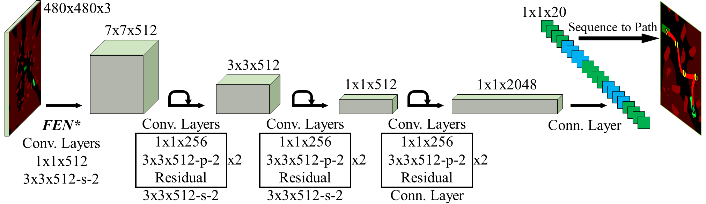

# DeepPlanning: Deep Learning-based Planning Method for Autonomous Parking

## 引言

该库是二阶段泊车路径规划方法（称为YIPSO）的实现与实验代码库，YIPSO的运行流程如图1所示。

<center>
    <br>
    <p align="left"><b>Figure 1. Our YIPSO Parking Path Planning System.</b> The procedure is straightforward: (1) encoding the scenario as an image, (2) run the neural network YIPS on the image, (3) run the optimizer SO-RRT* on the path from YIPS.</p>
</center>


## 计算平台

代码已在装有***NVIDIA Tesla P100***（GPU）、 ***Intel Xeon E5@3.20GHz***（CPU）和Ubuntu-16.04（操作系统）的计算平台上测试过，建议在类似的平台上运行。

为了避免重复安装依赖，YIPSO规划系统的主体代码（YIPS网络训练和规划效果评估）运行在已配置好的Docker容器中。为了生成运行代码所需的Docker容器：

1. 根据[Docker官方文档](https://docs.docker.com/engine/install/ubuntu/)安装Docker，然后根据[官方说明](https://docs.docker.com/engine/install/linux-postinstall/)进行*安装后配置*，如果跳过*安装后配置*，那么所有的Docker命令都需要加上“sudo”前缀才能运行。

   

2. 生成容器对应的镜像，名为：**glep:deep-planning-ros-base**，确保在本库的根目录（DeepPlanning）下运行：

   ```sh
   (DeepPlanning)$ ./build_docker_image.sh
   ```

   

3. 生成存放数据和代码的Volume，名为：**trouble**

   ```sh
   (DeepPlanning)$ ./create_volume.sh
   ```

   

4. 基于镜像生成容器，并挂载Volume，容器名为：**deep-planning**

   ```sh
   (DeepPlanning)$ ./create_container.sh
   ```

   

5. 将代码复制到Volume中：

   ```sh
   (DeepPlanning)$ ./copy_to_docker.sh
   ```

   

## YIPS路径规划神经网络

网络架构如下图所示。

<center>
    <br>
    <p align="left"><b>Figure 2: The Architecture of YIPS.</b> FEN denotes Feature Extract Networks, it can be VGG, ResNet and etc., but VGG is the best choice in our test. In the ’Sequence to Path’ processing, we make use of the Reeds Shepp curves to connect configurations to generate the path planned by YIPS.</p>
</center>

### 训练YIPS网络

进入上述生成的**deep-planning**容器：

```sh
$ docker start -i deep-planning
```

另开一个终端，用已有数据集训练网络（默认选编号为0的GPU，可以在运行脚本中修改），训练的相关配置包含在文件***DeepPlanning/YIPS/config.json***中：

```sh
(DeepPlanning)$ ./train_yips.sh
```

返回进入**deep-planning**容器的终端，启动Tensorboard：

```sh
$ cd /home/trouble/YIPSO_Parking_Planner/YIPS && tensorboard --logdir logs/
```

在本地浏览器中打开“localhost:6008 ”就可以看到Tensorboard。

### 已训练的YIPS权重

已训练好的权重包含在文件夹 ***DeepPlanning/YIPS/weights_of_trained_yips*** 下。

### 在验证集上运行已训练的YIPS网络

进入上述生成的**deep-planning**容器:

```shell
$ docker start -i deep-planning
```

选择运行YIPS网络的GPU的编号:

```shell
$ export CUDA_VISIBLE_DEVICES=0
```

运行YIPS网络，输出结果保存在 ***DeepPlanning/YIPS/predictions_of_trained_yips/valid*** 下：

```shell
$ cd /home/trouble/DeepPlanning/YIPS && python predict.py
```


### YIPS性能评估

评估代码包含在***DeepPlanning/Experiments/EvaluateYIPS***文件夹下，部分需要使用matplotlib库进行可视化，所以不适合在Docker容器中运行，建议在本地运行。


## SO-RRT*路径优化算法

算法代码包含在文件夹 ***DeepPlanning/YIPS/pyRRT*** 下，详见文件夹下的Readme文档。


## YIPSO泊车路径规划评估

车辆配置包含在文件 ***DeepPlanning/VehicleConfig.md*** 中。

### 和OSE启发的Bi-RRT\*和GBS启发的Bi-RRT\*进行对比

> OSE启发式的代码包含在文件夹***DeepPlanning/YIPS/pySEA*** 下，详见文件夹下的Readme文档。

进入上述生成的**deep-planning**容器:

```shell
$ docker start -i deep-planning
```

选择运行YIPS网络的GPU的编号:

```shell
$ export CUDA_VISIBLE_DEVICES=0
```

计算评估结果：

```shell
$ cd /home/trouble/DeepPlanning/Experiments/EvaluateYIPSO && python evaluate_planning.py
```

更多的评估代码包含在***DeepPlanning/Experiments/EvaluateYIPSO***文件夹下，部分需要使用matplotlib库进行可视化，所以不适合在Docker容器中运行，建议在本地运行。